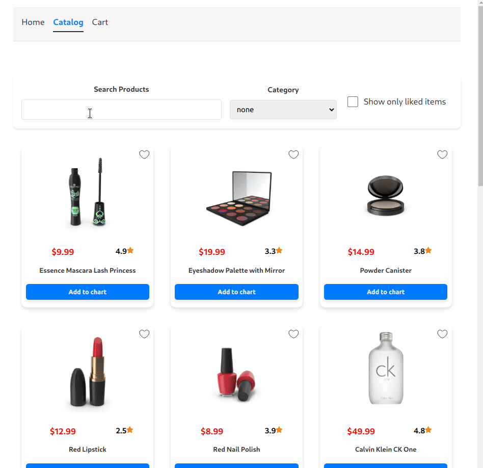

# Shop-app

This project is a **shopping app** built as a frontend exercise to improve React development skills. It includes dynamic features like cart management, notifications, and responsive layouts



## 🛠️ Technologies used

-  **Core Technologies:** HTML, CSS, React 18, TypeScript, Vite  
-  **State Management:** Redux Toolkit, Redux Persist  
-  **Routing:** React Router  
-  **Utilities & Enhancements:** React Toastify, React Paginate  

## What is Done

1. Core Features Implemented:
   - `/catalog`: Dynamic product list with "Add to Cart" functionality.
      - 🔍 Dynamic searching by product name
      - 📄 Catalog pagination
      - 🏷️ Filtering by category and liked
   - `/cart`: Cart Summary: Displays total item count and price.
   - `/product/id`: Dynamic page for each product with information
   - You can add a product cards as your favorite ❤️
   - Responsive design with CSS **grid layouts**
     
2. State Management:
   - Used **Redux** with selectors to handle the cart state efficiently.
   - Dispatched actions for cart updates and cleanups.
     
3. Component Design:
   - Modular and reusable components

## What new I've learned

- React:
  - Learned to create more generic components to reuse them later

- Redux:
  - Setting up a **store** and managing **actions**.
  - Organize actions and selectors into feature **slices**
  - Save state in **localStore** with **redux-persist**
  - Async load with **thunks**

- CSS:
  - How to use **grid** for creating adaptive components and pages
  - How to use **variables** for theme consistency

- Pagination with **react-paginate**
  
- Notifications with **react-toastify**

## How to run

```bash
git clone https://github.com/deeprecession/shop-app
cd shop-app
npm install
npm start
```

## Possible Improvements

- [ ] Backend Integration: Add a server to fetch product data dynamically.
- [ ] User Authentication: Allow users to save cart progress.
- [ ] Payment Gateway: Simulate a payment flow for enhanced realism.
- [ ] Animations: Improve user experience with smoother transitions.
- [ ] Testing: Implement unit and integration tests for components.
